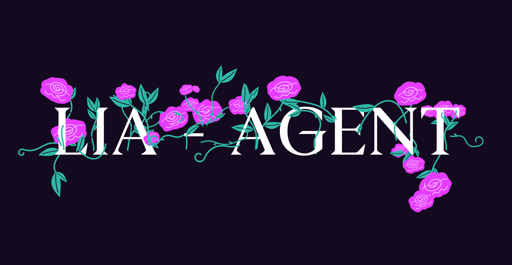

<p align="center">
  
</p>

# LiaAgent'i Ollama ile kullanma

Bu rehber, bu depodaki `ollama-tool-followup` branch'ini başka bir bilgisayara kurup yerel Ollama modeline bağlamak içindir. Kurulum üç ayrı parçadan oluşur:

- **LiaAgent/Hermes:** Bu deponun kurulum betiğiyle yüklenir.
- **Ollama:** İşletim sisteminize uygun Ollama kurulumuyla yüklenir.
- **LLM modeli:** `ollama pull` komutuyla Ollama'ya ayrıca indirilir.

Hermes kurulum betiği Ollama'yı veya Gemma model dosyalarını indirmez. Model indirmek için gereken depolama alanı da bilgisayarınızda ayrıca bulunmalıdır.

## Gerekenler

- GitHub'da branch'inizi içeren bir depo. Özel depo kullanıyorsanız hem `curl` hem de `git` erişiminin yeni bilgisayarda ayarlanmış olması gerekir; en kolay yol erişilebilir bir public depodur.
- Linux, macOS veya Windows üzerinde WSL2. Windows için aşağıdaki Hermes adımları WSL terminalinde çalıştırılmalıdır.
- Ollama'nın desteklediği, bilgisayarınızın belleğine sığan ve araç çağrısı yapabilen bir model. Modelin bellek ve disk ihtiyacı modele göre değişir.

## 1. Branch'inizi GitHub'a gönderin

Önce bu projedeki `ollama-tool-followup` branch'inin [GitHub deposunda](https://github.com/Muhammedokbi/hermes-agent) bulunduğundan emin olun. Bu çalışma kopyasının `origin` remote'u bu depoya işaret ediyor. Depo kök dizininde remote'u kontrol edip branch'i gönderin:

```bash
git remote -v
git push -u origin ollama-tool-followup
```

`git remote -v` çıktısında `origin` başka bir depoyu gösteriyorsa push etmeden önce doğru remote'u kullanın. Branch GitHub'a daha önce gönderildiyse bu adımı yeniden yapmanız gerekmez.

## 2. LiaAgent/Hermes'i kurun

Yeni bilgisayarda Linux, macOS veya WSL2 terminali açın ve şu komutları çalıştırın:

```bash
REPO_URL="https://github.com/Muhammedokbi/hermes-agent.git"
BRANCH="ollama-tool-followup"
curl -fsSL "https://raw.githubusercontent.com/Muhammedokbi/hermes-agent/$BRANCH/scripts/install.sh" -o /tmp/lia-install.sh
HERMES_REPO_URL="$REPO_URL" bash /tmp/lia-install.sh --branch "$BRANCH"
```

Bu komut, kurulum betiğini belirttiğiniz GitHub deposundan alır ve Hermes kaynak kodunu aynı depo ile branch'ten kurar. Kurulum tamamlandığında yeni bir terminal açıp komutun erişilebilir olduğunu kontrol edin:

```bash
lia --version
```

Kurulum betiği `lia` komutunu sağlar; `hermes` komutu da geriye dönük uyumluluk için kullanılabilir. Bu adım Ollama'yı veya herhangi bir LLM modelini kurmaz.

## 3. Ollama'yı kurup çalıştırın

[Ollama indirme sayfasından](https://ollama.com/download) işletim sisteminize uygun sürümü kurun. Linux'ta Ollama'nın resmi kurulum komutunu da kullanabilirsiniz:

```bash
curl -fsSL https://ollama.com/install.sh | sh
```

macOS'ta indirme sayfasındaki uygulamayı kurup açın. Windows'ta Ollama Windows üzerinde çalışabilir; LiaAgent'i WSL2'de çalıştırıyorsanız WSL içinden Ollama'ya erişilebildiğini ayrıca doğrulayın. Her iki programı da aynı işletim sistemi ortamında çalıştırmak genellikle en kolay seçenektir.

Ollama'nın çalıştığını kontrol edin:

```bash
ollama --version
ollama list
```

`ollama` komutu bulunamıyorsa Ollama kurulumu tamamlanmamış olabilir veya terminali yeniden açmanız gerekebilir.

## 4. Gemma 4 modelini Ollama'ya indirin

Bu rehberde `gemma4:12b` modeli kullanılıyor. Ollama'ya indirmek için:

```bash
ollama pull gemma4:12b
ollama list
```

`ollama pull` modeli Ollama'nın yerel model deposuna indirir; model dosyası bu Git deposuna eklenmez. Model indirme ve çalıştırma için gereken disk/RAM/VRAM miktarı bilgisayara ve Ollama'nın model sürümüne bağlıdır. Modelin araç çağrılarını desteklediğinden emin olun. Başka bir model kullanmak isterseniz aşağıdaki `gemma4:12b` değerlerini Ollama'daki model etiketiyle değiştirin.

## 5. LiaAgent'i Ollama'ya bağlayın

Kurulum sihirbazını başlatın:

```bash
lia setup
```

Sağlayıcı olarak **Custom Endpoint** seçip şu değerleri girin:

- Provider: `custom`
- API mode: `chat_completions`
- Base URL: `http://127.0.0.1:11434/v1`
- API key: boş bırakın; Ollama yerel bağlantıda API anahtarı gerektirmez.
- Model: `gemma4:12b`

Bu URL, Ollama aynı bilgisayarda ve LiaAgent ile aynı ağ ortamında çalışırken kullanılır. Ollama başka bir bilgisayarda veya Windows ana makinede, LiaAgent ise WSL2'de çalışıyorsa `127.0.0.1` yerine WSL'den erişilebilen adresi kullanın.

Gerekirse `~/.hermes/config.yaml` dosyasındaki `model` bölümü şu şekilde olabilir:

```yaml
model:
  default: gemma4:12b
  provider: custom
  base_url: http://127.0.0.1:11434/v1
  api_mode: chat_completions
```

Elle düzenleme yaptıysanız dosyayı kaydedin ve her alanın girintisini koruyun.

## 6. Bağlantıyı ve araç çağrısını deneyin

Önce Ollama'nın API'sine erişilebildiğini kontrol edin:

```bash
curl http://127.0.0.1:11434/api/tags
```

Yanıtta indirdiğiniz model listelenmelidir. Ardından LiaAgent'i başlatın:

```bash
lia
```

Önce basit bir mesaj deneyin. Sonra modelden terminal aracını kullanarak `pwd` komutunu çalıştırmasını isteyin; yanıtın araç çağrısından sonra devam ettiğini kontrol edin. Model yalnızca metin yanıtlıyor ve araç çağrısı yapmıyorsa seçtiğiniz modelin Ollama'da araç çağrısını desteklediğini doğrulayın.

Bu branch'te LiaAgent, yerel Ollama sunucusunu algıladığında native `/api/chat` yolunu kullanır. Bu yol, araç sonucu geldikten sonra konuşmayı sürdürmek için gerekli mesaj biçimini ve `num_ctx` ayarını destekler.

## Sorun giderme

- `ollama list` içinde model görünmüyorsa `ollama pull <model-adı>` komutuyla indirin.
- `curl` bağlantı hatası veriyorsa Ollama'nın çalıştığını ve LiaAgent'in kullandığı ortamdan erişilebilir olduğunu kontrol edin.
- Model araç çağrısı yapmıyorsa Ollama'da tool calling destekleyen bir model seçin.
- Daha küçük bir model seçmek bellek ihtiyacını azaltabilir; yanıt kalitesi ve araç kullanımı modelden modele değişir.


## eksık
────────────────────────────────────────
● şimdi kamerayi aç kamerada ne gordugunu ozetle bana
────────────────────────────────────────


┌─ Reasoning ───────────────────────────────────────────────────────────────────────────────────────────────────────────────────────┐
The user wants me to "open the camera" and summarize what I see.
I am an AI assistant (Hermes Agent) operating in a text-based/code-driven environment
.
I do *not* have direct, real-time access to the user's device camera.

I should explain this limitation clearly but politely.

Plan:
1. State that I cannot directly access the camera.
2. If the user provides an image or uses a tool like `vision_analyze` (if an image
 path were provided), I could see that, but a live camera stream is not a capability
.
└───────────────────────────────────────────────────────────────────────────────────────────────────────────────────────────────────┘

╭─ ☤ Hermes ────────────────────────────────────────────────────────────────────────────────────────────────────────────────────────╮
Maalesef doğrudan cihazınızın kamerasını açma veya canlı video akışını görme yeteneğim bulunmuyor. Ancak, bir fotoğraf çekip bana gönderirseniz veya bir görselin yolunu belirtirseniz, o görüntü üzerinde analiz yapabilir ve size içeriğini özetleyebilirim.
╰───────────────────────────────────────────────────────────────────────────────────────────────────────────────────────────────────╯
 ☤ gemma4:12b │ 21.5K/262.1K │ [█░░░░░░░░░] 8% │ ◷ 28.2s │ ↑ 11 t/s │ 6m │ ⏲ 28s │ ✓ 0s                 ─ Terminal ls komutu ve özet 
─────────────────────────────────────────────────────────────────────────────────────────────────────────────────────────────────────
❯ Turn these notes into a to-do list
─────────────────────────────────────────────────────────────────────────────────────────────────────────────────────────────────────
 
